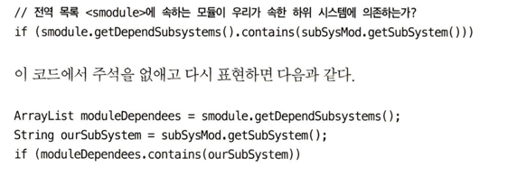

# 주석
잘 달린 주석은 그 어떤 정보보다 유용하다. 오래되고 조잡한 주석은 거짓과 잘못된 정보를 퍼트린다.

사실상 주석은 기껏해야 필요악이다. 프로그래밍 언어 자체가 표현력이 풍부하다면 혹은 우리가 치밀하게 사용해 의도를 표현한다면 주석읜 거의 필요 하지 않다.

코드로 의도를 표현하지 못하면 주석을 사용한다. 주석은 언제나 실패를 뜻한다.

항상 주석을 쓸 때면 코드로 표현할 방법은 없는지 생각해야한다.

주석에 대해 이렇게 말 하는 이유는 시간이 지날수록 코드가 변하지만 여기에 맞춰서 주석도 변화하지 못하기 때문이다.

## 주석은 나쁜 코드를 보안하지 못한다.

코드에 주석을 추가하는 일반적인 이유는 코드 품질이 나쁘기 때문이다. 모듈을 짜고 보니 짜임새가 엉망이고 알아먹기 힘들기 때문에

"주석을 달아야겠다!" 라고 생각한다. 주석대신 난장판을 치우는데 시간을 보내라

## 코드로 의도를 표현하라!

(0)

위 코드를 보면 코드로 의도를 표현할 수 있다. 많은 경우에 주석으로 달려는 설명은 코드로 충분히 설명이 가능하다.

## 좋은 주석
### 법적인 주석
회사가 정립한 구현 표준에 맞춰 법적인 이유로 특정 주식을 넣으라고 명시한다. 예를 들어 소스 파일 첫머리에 주석으로 들어가는 저작권 정보와 소유권 정보는 필요하고
타당하다.

(1)

### 정보를 제공하는 주석

기본적인 정보를 주석으로 제공하면 편리하다. 예를 들어 반환할 값에 대한 설명이나 혹은 정규식등이 어떤 형태를 뜻하는지 말이다.

하지만 이조차도 코드로 표현하는게 좋다.

### 의도를 설명하는 주석

때로는 구현에 대한 결정에 깔린 의도를 설명해주는 주석이 좋다.

~~~
스레드를 만들어 n개의 스레드에서 병렬작업으로 경쟁 조건을 만든다. 등등..
~~~

## 나쁜 주석
나쁜 주석의 예시가 나온다. 주절주절 나열되는 주석 / 오해할 여지가 있는 주석 / 반복되는 주석 등이 있다.

javadoc 등에 의무적으로 다는 주석도 필요없다고 말한다.

이력을 남기는 주석도 필요 없다고 한다. 지금은 versionControl이 되니까..

### 어떻게 해야 하는가

함수나 변수로 표현할 수 있다면 주석을 달지 말아라.

(2)

